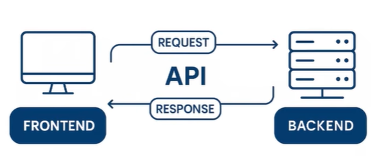
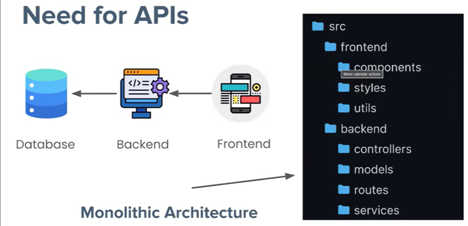

# FastAPI Notes: Fundamentals & Architecture

A comprehensive guide to understanding APIs, architectural shifts, and the core philosophy of the FastAPI framework.

---

## 1. What is an API?

**APIs (Application Programming Interfaces)** are mechanisms that enable two software components—such as an application's frontend and backend—to communicate with each other using a defined set of rules, protocols, and data formats.



### 💡 The Analogy
Think of an API as a **waiter** in a restaurant. You (the client) sit at the table with a menu of choices. The kitchen (the server) prepares the food. The waiter is the messenger that delivers your order to the kitchen and brings the food back to you.


---

## 2. The Shift from Monolithic Architecture

In the early days of web development, the frontend (UI) and backend (Logic/Database) were bundled into a single codebase and deployed as one unit. This is known as **Monolithic Architecture**.



### 🛑 Limitations of Monolithic Architecture
While simple to start, monoliths present significant challenges as an application grows:

* **Tight Coupling:** Because the UI and Logic are "intertwined," making a small change to the frontend might require redeploying the entire backend. This makes the system fragile.
* **Lack of Reusability:** In a monolith, the backend logic is "trapped" inside the app. For example, if **IRCTC** used a monolith, they couldn't easily share their ticket-booking logic with third-party apps like **MakeMyTrip**. They would have to rewrite the logic for every partner.
* **Platform Duplication:** If you want to launch on Android, iOS, and Web, a monolithic approach often requires building three separate "silos" where the backend logic is duplicated for each platform. 
* **Scaling Difficulty:** You cannot scale just the heavy-traffic parts of your app; you must scale the entire monolith, which wastes server resources.

> **The API Solution:** By separating the backend into an API, you create a "single source of truth." One backend can now serve the Web, Android, iOS, and third-party partners simultaneously.

---

## 3. What is FastAPI?

**FastAPI** is a modern, high-performance web framework for building APIs with Python 3.8+ based on standard Python type hints. It sits on the shoulders of two giants:

1.  **Starlette:** A lightweight ASGI framework/toolkit, which is ideal for building high-performance async services. It handles the "plumbing"—how your API receives requests and sends responses.
2.  **Pydantic:** A library for data validation and settings management using Python type annotations. It ensures that the data entering or leaving your API is formatted correctly.

---

This section of your documentation is excellent as it dives into the "Why" behind the framework. I have polished the technical explanations—specifically the transition from **WSGI** to **ASGI**—to ensure the distinction is crystal clear for any developer reading your README.

---

## 🏛️ The Philosophy of FastAPI

FastAPI is built upon two core pillars that solve the "Speed vs. Developer Experience" trade-off:

* **⚡ Fast to Run:** Performance on par with **NodeJS** and **Go**, powered by **Starlette** and **Pydantic**.
* **✍️ Fast to Code:** Minimizes bugs and accelerates development through Python **type hints**, providing auto-completion and instant validation.

---

## 🏎️ Why is FastAPI "Fast to Run"?

To understand FastAPI's speed, we must look at how it handles the **SGI (Server Gateway Interface)**—the bridge between the Web Server and your Python code.

### The Traditional Way: WSGI (Flask/Django)
Most traditional Python frameworks use **WSGI** (Web Server Gateway Interface). 
* **Mechanism:** It handles requests **synchronously**.
* **The Problem:** If one request is waiting for a database or an ML model to respond, the entire worker is "blocked." It can only handle one request at a time per worker.
* **Stack:** Gunicorn + Werkzeug + Flask.

### The Modern Way: ASGI (FastAPI)
FastAPI utilizes **ASGI** (Asynchronous Server Gateway Interface), implemented via the **Starlette** library.
* **Mechanism:** It supports `async` and `await`. While the API waits for an external process (like an ML prediction or a DB query), it can move on to serve the next request.
* **The Benefit:** Non-blocking I/O allows thousands of concurrent connections on a single process.
* **Stack:** Uvicorn + Starlette + FastAPI.


---

## 🛠️ Why is FastAPI "Fast to Code"?

1.  **Automatic Input Validation:** Uses Pydantic to ensure incoming data matches your requirements before it even hits your logic.
2.  **Auto-Generated Docs:** Instantly creates interactive **Swagger UI** and **ReDoc** pages. No manual documentation required.
3.  **Modern Ecosystem:** Native support for OAuth2, JWT, SQLAlchemy, and seamless containerization with Docker/Kubernetes.

---

## 🚀 Getting Started

### 1. Create a Virtual Environment
Using a virtual environment keeps your project dependencies isolated and prevents version conflicts.
```bash
python -m venv venv
```

### 2. Activate the Environment
* **Windows:**
    ```powershell
    # If scripts are disabled, run: Set-ExecutionPolicy -ExecutionPolicy RemoteSigned -Scope Process
    .\venv\Scripts\activate
    ```
* **Mac/Linux:**
    ```bash
    source venv/bin/activate
    ```

### 3. Install Dependencies
```bash
pip install fastapi uvicorn pydantic
```

### 4. Run the Application
Start the server using **Uvicorn** with hot-reloading enabled:

**If `main.py` is inside an `app` folder:**
```bash
uvicorn app.main:app --reload
```

**If `main.py` is in the root directory:**
```bash
uvicorn main:app --reload
```

---

> **Deep Note:** When deploying an ML model, the `async` nature of FastAPI is a game-changer. It allows the server to remain responsive to heartbeat checks and other lightweight requests even while the CPU is crunching numbers for a heavy prediction.