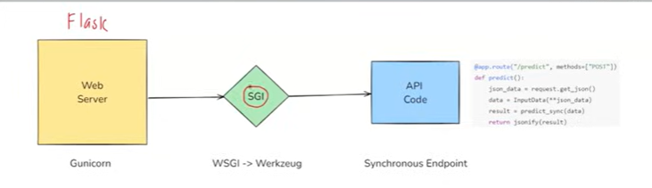
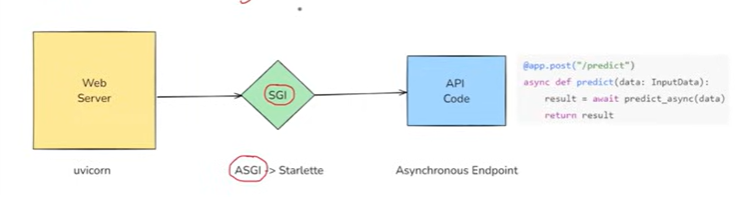

# FastAPI Notes: Fundamentals & Architecture

A comprehensive guide to understanding APIs, architectural shifts, and the core philosophy of the FastAPI framework.

---

## 1. What is an API?

**APIs (Application Programming Interfaces)** are mechanisms that enable two software components—such as an application's frontend and backend—to communicate with each other using a defined set of rules, protocols, and data formats.

### 💡 The Analogy
Think of an API as a **waiter** in a restaurant. You (the client) sit at the table with a menu of choices. The kitchen (the server) prepares the food. The waiter is the messenger that delivers your order to the kitchen and brings the food back to you.

---

## 2. The Shift from Monolithic Architecture

In the early days of web development, the frontend (UI) and backend (Logic/Database) were bundled into a single codebase and deployed as one unit. This is known as **Monolithic Architecture**.

### 🛑 Limitations of Monolithic Architecture
While simple to start, monoliths present significant challenges as an application grows:

* **Tight Coupling:** Because the UI and Logic are "intertwined," making a small change to the frontend might require redeploying the entire backend. This makes the system fragile.
* **Lack of Reusability:** In a monolith, the backend logic is "trapped" inside the app. For example, if **IRCTC** used a monolith, they couldn't easily share their ticket-booking logic with third-party apps like **MakeMyTrip**. They would have to rewrite the logic for every partner.
* **Platform Duplication:** If you want to launch on Android, iOS, and Web, a monolithic approach often requires building three separate "silos" where the backend logic is duplicated for each platform. 
* **Scaling Difficulty:** You cannot scale just the heavy-traffic parts of your app; you must scale the entire monolith, which wastes server resources.

> **The API Solution:** By separating the backend into an API, you create a "single source of truth." One backend can now serve the Web, Android, iOS, and third-party partners simultaneously.

---

## 3. What is FastAPI?

**FastAPI** is a modern, high-performance web framework for building APIs with Python 3.8+ based on standard Python type hints. It sits on the shoulders of two giants:

1.  **Starlette:** A lightweight ASGI framework/toolkit, which is ideal for building high-performance async services. It handles the "plumbing"—how your API receives requests and sends responses.
2.  **Pydantic:** A library for data validation and settings management using Python type annotations. It ensures that the data entering or leaving your API is formatted correctly.

---

## 4. The Philosophy of FastAPI

The framework is designed around two core pillars:

* **⚡ Fast to Run:** It offers performance on par with **NodeJS** and **Go**, thanks to its asynchronous capabilities and Starlette integration.
* **✍️ Fast to Code:** It reduces developer error and increases speed by using type hints for automatic validation, documentation (Swagger), and editor support (auto-completion).

# Exacty why the fast API is fast to run - 
Lets say we are making a API for a ML model.
Lets say we set an endpoint /predict in this API.
The endoint take 2 inputs f1 and f2, then gives prediction p.
Then we deployed the API on AWS.(API code and Web server on AWS)

Client --> HTTP request --> Web Server --> SGI --> API Code 

Web server sends the HTTP request to our API  
Requset is an HTTP requset which python cannot understand. To convert HTTP requst to pyhton understandable format there is SGI
SGI establishes a 2 way communivation between the web setver and the API
Now python code take the feature values and generates a prediction
SGI converts the python output to a HTTP response

How flask uses this flow

SGI is a protocal and to implement this protocaol we need a library
Flask uses Werkzeug library for imoplementing SGI protocaols
Flask uses Gunicorn as Server
In Flask the endpoint(API) is also synchronous.
SGI we use is WSGI (Web Server Gateway Interface)
disadvantage of wsgi is that it is synchronous in nature -> one user at a time and there is a blocking nature.

How FastAPI uses this flow
In FastAPI the SGI we are using is ASGI
Implemented using the Starlette library

Fast API uses Uvicorn as python web server
Fast API supports async and await features of python 

# Why FastAPI is fast to code?
1. Automatic input Validation
2. Auto-Generated Interactive Documentation
3. Seamless Integration with Modern Ecosystem(ML/DL libraries, OAuth, JWT, SQL Alchemy, Doc ker, Kubernetes)

Steps to get stared:-
1. Create a python virtual environment(Why?)
pyhton -m venv myenv

2. Activate out virtual envitonment
myenv\Scripts\activate
use command if running scripts is disabled
Set-ExecutionPolicy -ExecutionPolicy RemoteSigned -Scope Process

3. Install Libraries
pip install fastapi uvicorn pydantic

4. To run our app
uvicorn app.main:app --reload

if main is outside app folder
uvicorn main:app --reload
